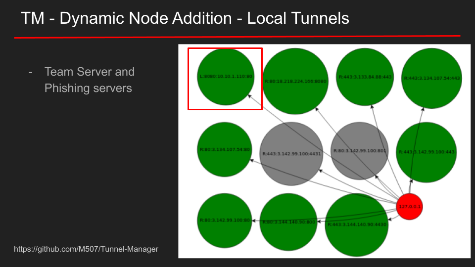

# Tunnel-Manager

Why did I make this? Because I need a system that can:
- Create C2 traffic redirectors automatically.
- Replace burned IPs quickly.
- Spawn up and destroy remote and local tunnels automatically.
- Persistent tunnel configurations.
- Shareable configurations.
- Visualization of the network flow.
- Wipe out everything from AWS when done. 

There are no documents currently. The following slides could explain some of the tool's features.

## Installation

To properly launch the application:

- Use `variables.env.example` to create your own `variables.env` file. The file must be in the project's root directory.
- GoJS is a dependency that is up to you to download. It offers pretty nice visualizations. You can download it from here https://gojs.net/latest/download.html and copy it to application/static/go.js. 
- Run install.sh to install the app's dependencies

For more details: <a style="color:#c0c0c0" href="https://shellcode.blog/Using-Cobalt-Strike-with-Tunnel-Manager-for-Distributed-Hacking/"> Using Cobalt Strike with Tunnel-Manager for Distributed Hacking (v0.0.1 - Old version) </a>